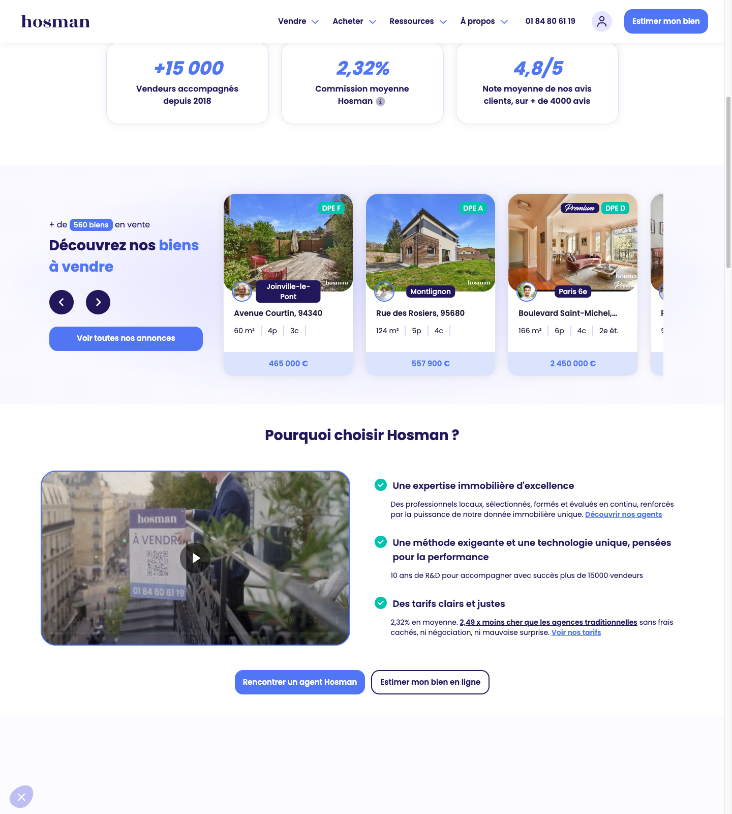
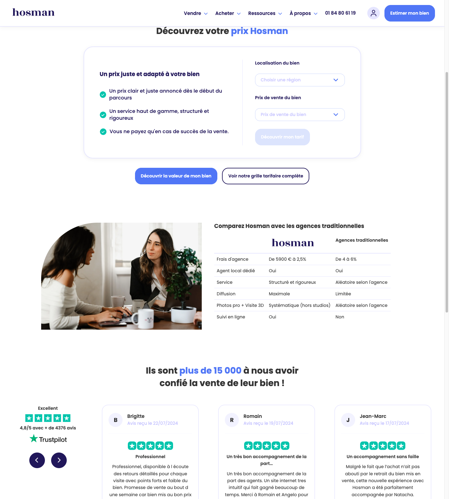
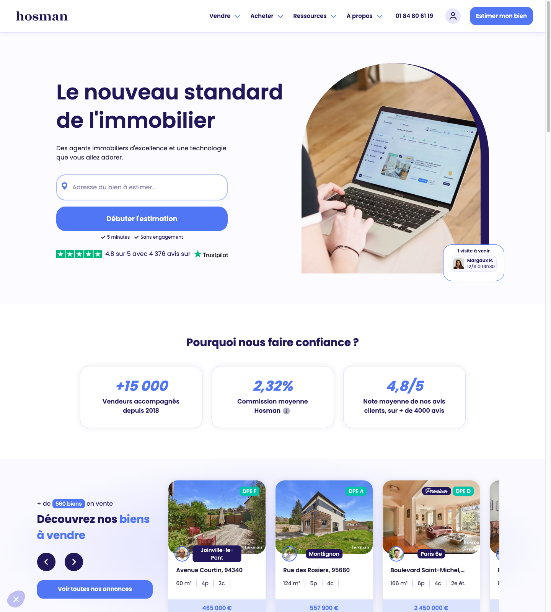
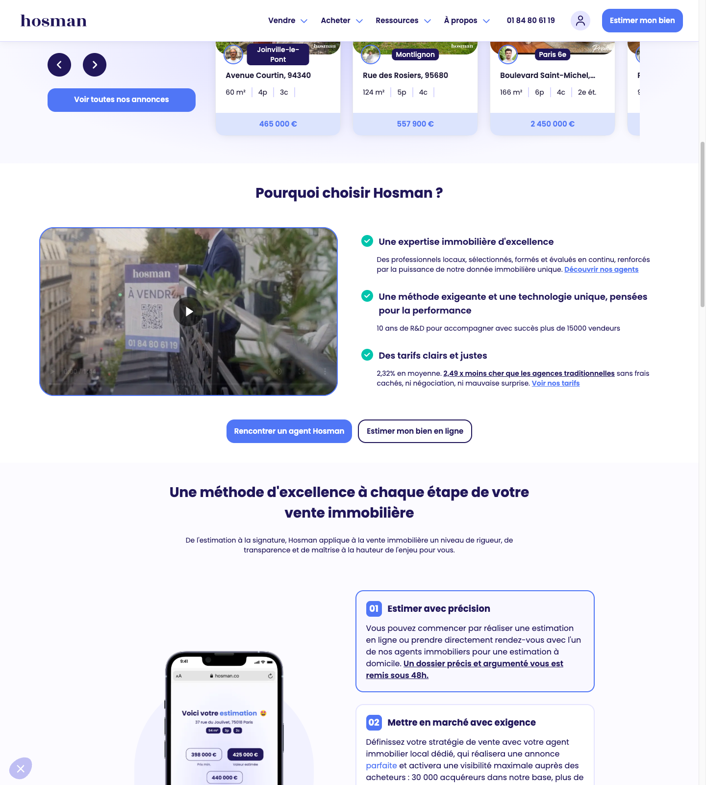
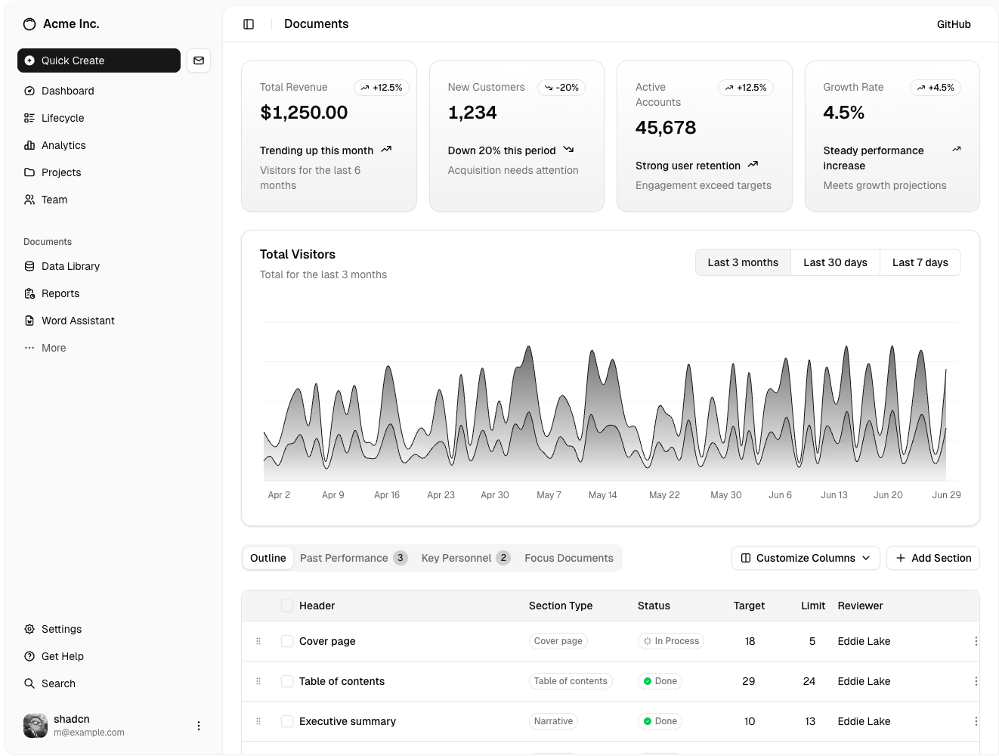
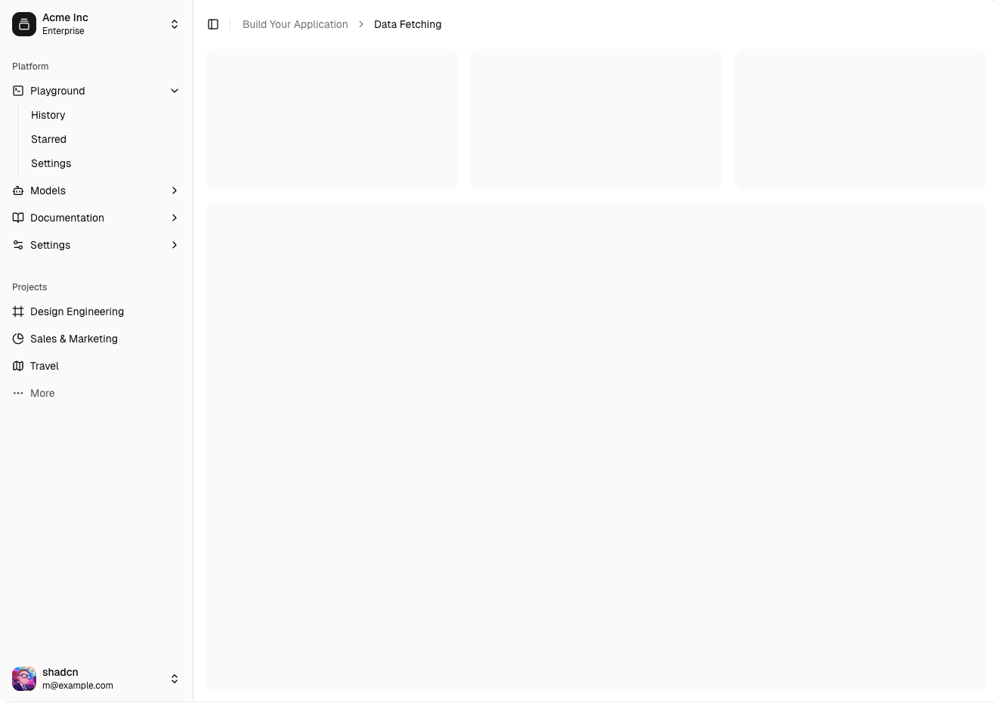
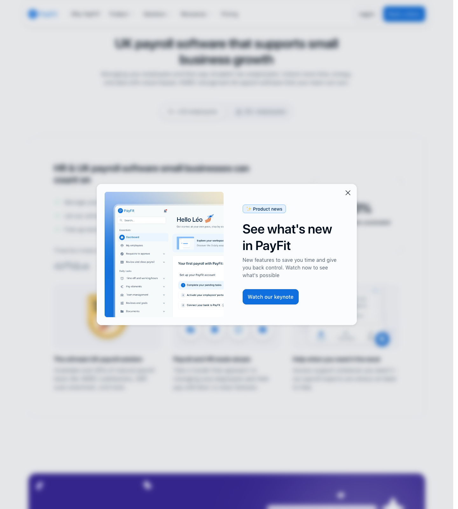

# buyer-codex Design Decisions

This file is the implementation-facing design source of truth for buyer-codex.

It is not a mood board. It exists so another agent can build a homepage hero, trust section, pricing/calculator section, property card, or authenticated shell without reopening the reference sites.

Implementation note: the canonical token contract lives in `packages/shared/src/theme.ts` and is mirrored into `design-references/tokens.ts`, `design-references/tokens.css`, and `ios/BuyerCodex/Sources/Design/BrandTheme.swift` via `pnpm tokens:sync`. This document captures rationale and surface mapping; the generated token artifacts are the exact implementation values.

## 1. Decision Hierarchy

- **Aesthetic winner:** PayFit
- **Structural winner:** Hosman
- **Authenticated shell winner:** shadcn preset `b2D0wqNxS` family
- **Supplementary only:** RealAdvisor

When references conflict:

1. Use **Hosman** for page sequencing, conversion flow, and hero/trust/calculator structure.
2. Use **PayFit** for spacing rhythm, type confidence, card/button polish, and motion restraint.
3. Use **shadcn `b2D0wqNxS`** for dashboard shell, left-nav rhythm, card density, and app scaffolding.
4. Use **RealAdvisor** only for data-specific motifs such as compact numeric badges and optional list-plus-map composition.

**PayFit still defines the base atmosphere:** deep trust blues, cool teal action accents, restrained violet secondary depth, generous whitespace, crisp type confidence, smooth micro-interactions, and polished component surfaces. The overall feeling should remain modern European SaaS: professional without feeling corporate, friendly without feeling juvenile.

## 2. Screenshot Provenance

- `Hosman`, `PayFit`, and `shadcn` screenshots in `design-references/screenshots/` were captured on **2026-04-13** via Chrome DevTools MCP in this branch.
- `RealAdvisor` was behind a Cloudflare verification wall in Chrome DevTools on **2026-04-13**. The vendored files under `design-references/screenshots/realadvisor/` come from a prior **2026-03-23 Chrome browser automation capture** already present on disk. They are used only for supplementary pattern decisions.
- When a rule below says **Inference**, it means the implementation rule is derived from the screenshot plus the priority hierarchy above, not copied literally from the reference.

## 3. Fast Rules

- Public pages should feel **trustworthy, bright, and guided**, not clever or experimental.
- Authenticated pages should feel **calmer and denser** than marketing pages, but still belong to the same system.
- One strong CTA is better than multiple competing actions.
- Property decisions must feel **high-signal**. Avoid decorative noise, novelty layouts, or startup-generic AI styling.
- Use `design-references/tokens.css` and `design-references/tokens.ts` for exact token values. This file decides **which pattern wins** and **how to use it**.

## 4. Surface Winner Matrix

| Surface | Winning reference | Supporting reference | Explicit loser(s) |
| --- | --- | --- | --- |
| Homepage hero | Hosman | PayFit polish | PayFit app-demo hero, RealAdvisor valuation hero |
| Trust strip | Hosman | PayFit spacing discipline | Review-card carousels, logo-wall-only trust rows |
| Pricing / calculator section | Hosman | PayFit input/card polish | SaaS pricing-tier tables, wizard-first flows |
| Paste-link CTA card | Hosman | PayFit button/input finish | Multi-field tools, stepper-first entry |
| Score badge | RealAdvisor | PayFit color discipline | Hosman ribbons, generic shadcn text badges |
| Property / search card | Hosman | RealAdvisor map/list ideas | Portal-density cards, map-inside-card layouts |
| Dashboard shell | shadcn `b2D0wqNxS` family | PayFit calmness | Hosman landing-page composition in app space |
| Left nav | shadcn `b2D0wqNxS` family | PayFit spacing discipline | Top-nav-only app shells, icon-only expanded nav |
| Section spacing rhythm | PayFit | Hosman sequencing | Tight SaaS spacing, dense portal packing |

Implement these choices through semantic aliases rather than source-named tokens. Components should depend on intent-level tokens such as `background`, `foreground`, `surface`, `border`, `primary`, `muted`, and `shadow`, while the shared theme contract owns the underlying scales.

## 5. Surface Rules

### 5.1 Homepage Hero

**Winner:** Hosman  
**Why:** Hosman is the clearest reference for a real-estate conversion hero with one dominant action above the fold. PayFit improves finish, but not structure.

**Adopted patterns**

- Two-zone hero: message and entry action on the left, visual proof/product-adjacent imagery on the right.
- Headline is short, outcome-led, and easy to scan in two or three lines.
- The primary action is embedded in the hero itself, not deferred to a later section.
- Supporting proof sits immediately below the action cluster rather than in a disconnected band.

**Rejected patterns**

- PayFit's product-demo-first hero. It is too SaaS-tool oriented and makes buyer-codex feel like software before it feels like brokerage guidance.
- RealAdvisor's valuation-first hero. It is too tool-driven and too blue-portal in tone for the homepage.
- Centered generic startup hero layouts with floating gradients and no directional flow.

**Do**

- Keep the hero interaction visible without scrolling.
- Let the right side show believable housing or workflow context, not abstract illustration alone.
- Preserve a strong left-to-right reading order.

**Don't**

- Do not stack multiple equal CTAs.
- Do not use a dark hero or an all-center layout for the homepage.
- Do not make the hero feel like a finance calculator landing page.

### 5.2 Trust Strip

**Winner:** Hosman  
**Why:** Hosman turns trust into a quick proof band with simple numbers and plain-language labels. It is closer to our brokerage trust problem than PayFit's broader logo-and-reviews treatment.

**Adopted patterns**

- Immediate post-hero proof band with 3-4 concise trust facts.
- Equal-weight stat modules with minimal decoration.
- Short labels that explain why the stat matters.

**Rejected patterns**

- Review-carousel trust treatments. They are too slow and too content-heavy for the first proof moment.
- Logo-cloud-only rows. They signal partnerships, not buyer confidence.
- Dense metric dashboards. This is reassurance, not analytics.

**Do**

- Use plain language and strong numerals.
- Keep the strip visually quieter than the hero.
- Let the strip confirm credibility before the page asks for more reading.

**Don't**

- Do not turn the trust strip into testimonial cards.
- Do not add more than four proof points on desktop.
- Do not use playful iconography or loud accent colors here.

### 5.3 Pricing / Calculator Section

**Winner:** Hosman  
**Why:** Hosman handles pricing as a credibility-building calculator/explainer, which matches buyer-codex better than subscription-table pricing.

**Adopted patterns**

- A single calculator/explainer section in the middle of the page.
- Inputs and payoff live in the same visual frame.
- The section explains savings or value transparently instead of asking for commitment first.

**Rejected patterns**

- Multi-plan SaaS pricing tables from PayFit-style software pages.
- Full-screen valuation wizard entry from RealAdvisor.
- Dense shadcn settings forms used as marketing sections.

**Do**

- Present one core input group and one results/benchmark group.
- Keep the result legible at a glance.
- Treat the section as trust-building evidence, not as a checkout page.

**Don't**

- Do not use three-column pricing plans.
- Do not hide the result behind a modal or next-step gate.
- Do not overload the calculator with secondary filters before the first result is shown.

### 5.4 Paste-Link CTA Card

**Winner:** Hosman  
**Why:** The Hosman hero input establishes the right interaction model: one prominent field, one clear action, immediate momentum.

**Adopted patterns**

- One large input field plus one decisive submit control.
- Placeholder text explains the action by example.
- Proof or reassurance belongs directly under the field.

**Rejected patterns**

- PayFit dual-button CTA clusters with no text input.
- Wizard-first entry that asks multiple questions before accepting the source URL.
- Busy card layouts with side filters, toggles, or segmented controls.

**Do**

- Keep the card focused on a single pasted listing URL.
- Attach loading, validation, and parse states directly to this field.
- Make the card feel premium through spacing and finish, not through extra chrome.

**Don't**

- Do not add multiple fields to the first interaction.
- Do not bury the submit action under helper copy.
- Do not make this look like a developer tool or a search console.

### 5.5 Score Badge

**Winner:** RealAdvisor  
**Why:** RealAdvisor is the best supplementary reference for compact numeric emphasis sitting directly on top of real-estate imagery.  
**Inference:** We adopt the pill shape, contrast, and overlay behavior from the valuation badge, but adapt the content from currency-per-meter to buyer-codex score/confidence language.

**Adopted patterns**

- One compact, filled numeric pill with very short text.
- Badge overlays media or sits beside the title, never as its own card.
- Strong contrast and immediate readability matter more than subtlety.

**Rejected patterns**

- Hosman ribbons such as `SOLD` or energy-grade labels. Those communicate market state, not analytical confidence.
- Default shadcn badges as the primary score treatment. They are too neutral and text-first.
- PayFit review stars or trust snippets as a proxy for deal scoring.

**Do**

- Keep the badge to one number plus, at most, one short label.
- Use it once per card as the main analytical signal.
- Keep the silhouette pill-like and glanceable.

**Don't**

- Do not make the badge multi-line.
- Do not turn the badge into a progress bar or mini chart.
- Do not place multiple competing badges on the same property image.

### 5.6 Property / Search Card

**Winner:** Hosman  
**Why:** Hosman's listing cards are closer to the photo-first, metadata-light card we want. RealAdvisor helps with optional list-plus-map composition, but not with the default card chrome.

**Supporting supplementary reference:** RealAdvisor shows how list + map can coexist, but it should remain optional rather than define the base card.

**Adopted patterns**

- Photo-first card with short metadata and a single primary number.
- Address or area label first, price or value next, supporting stats in one muted row.
- Score badge floats on the image or sits immediately beside the heading.

**Rejected patterns**

- Map-dominant portal composition as the default experience.
- Dense attribute stacks inside every card.
- Generic SaaS information cards from PayFit.

**Do**

- Keep cards clean enough for 3-up desktop grids and 1-up mobile stacks.
- Let imagery carry part of the decision-making workload.
- Use one muted metrics row for beds, baths, sqft, or equivalent.

**Don't**

- Do not embed a mini map inside each card.
- Do not use long unlabeled metadata dumps.
- Do not add multiple secondary chips under every listing.

### 5.7 Dashboard Shell

**Winner:** shadcn `b2D0wqNxS` family  
**Why:** The shadcn dashboard block gives the best starting shell for authenticated product surfaces: fixed left rail, quiet utility header, KPI row, then primary work area. That matches buyer-codex's buyer dashboard and internal tools better than either marketing reference.

**Adopted patterns**

- Permanent left rail with a clear content canvas.
- Summary cards up top, followed by one dominant data/work surface.
- Quiet chrome: app framing should support work, not compete with content.

**Rejected patterns**

- Reusing marketing-page section choreography inside authenticated pages.
- Hero-sized headings or oversized promotional cards in the app shell.
- RealAdvisor consumer-portal search layouts as the default dashboard scaffold.

**Do**

- Use the shell for both buyer-facing and internal authenticated surfaces.
- Restyle through buyer-codex tokens rather than inventing a second app system.
- Group information into clear work zones: summary, primary task surface, secondary context.

**Don't**

- Do not build authenticated areas as free-floating cards on a marketing page background.
- Do not make the app depend on a top-nav-only structure.
- Do not use decorative marketing imagery inside the shell itself.

### 5.8 Left Nav

**Winner:** shadcn `b2D0wqNxS` family  
**Why:** shadcn's sidebar blocks are the strongest reference for expandable, grouped, product-grade navigation with clear text rhythm and bottom-anchored account utilities.

**Adopted patterns**

- Grouped navigation sections with visible labels in expanded state.
- Utility and account actions anchored away from the primary route stack.
- Optional collapse-to-icons mode, but only as a secondary behavior.

**Rejected patterns**

- Icon-only expanded navigation.
- Hosman or PayFit top-nav patterns for authenticated surfaces.
- Header search bars acting as the primary app navigation model.

**Do**

- Keep the primary nav list short and decisive.
- Use consistent row rhythm and muted active states.
- Reserve badges for real exceptions, not every item.

**Don't**

- Do not stuff marketing CTAs into the sidebar.
- Do not show more than one level of navigation by default unless the page truly needs it.
- Do not treat the collapsed rail as the default desktop state.

### 5.9 Section Spacing Rhythm

**Winner:** PayFit  
**Why:** PayFit handles vertical cadence better than the other references. It gives us the right amount of calm space between sections without making the page feel sparse or editorially slow.

**Adopted patterns**

- Generous vertical section spacing on public pages.
- Tighter spacing inside cards than between sections.
- Clear white-space reset before a new section starts.

**Rejected patterns**

- Tight SaaS startup spacing that makes trust-heavy content feel rushed.
- RealAdvisor-style portal density on marketing pages.
- Large editorial interruptions or image-led pauses after every short section.

**Do**

- Keep marketing sections visually separated even when backgrounds are the same.
- Let headings breathe above grids and calculators.
- Tighten only after entering authenticated shells.

**Don't**

- Do not compress public sections into dashboard spacing.
- Do not leave giant dead zones between the hero and trust strip.
- Do not alternate every section with oversized decorative imagery.

## 6. Global Do / Don't Rules

### Do

- Combine **Hosman structure** with **PayFit polish**.
- Use **shadcn** as the authenticated scaffold, then restyle it through our tokens.
- Use **RealAdvisor** only where buyer-codex needs a compact numeric real-estate signal or optional map/list composition.
- Prefer calm, obvious hierarchy over novelty.
- Keep one primary action per section.

### Don't

- Do not import RealAdvisor's overall visual system wholesale.
- Do not default to generic SaaS pricing tables or app-demo heroes.
- Do not use purple gradients, glassmorphism, or AI-generic ornamentation.
- Do not treat dense portal layouts as the homepage default.
- Do not fork the public site and authenticated product into two unrelated visual systems.

## 7. If An Agent Has To Choose Quickly

If an implementation choice is not explicitly documented elsewhere, use these defaults:

1. **Public page layout:** Hosman structure.
2. **Spacing and finish:** PayFit.
3. **Authenticated shell and nav:** shadcn.
4. **Numeric overlay / score treatment:** RealAdvisor, adapted through our tokens.
5. **Property card:** Hosman card body plus RealAdvisor-style numeric emphasis only where needed.

If a new implementation still feels plausible in multiple ways after applying those rules, reject the option that is:

- denser
- darker
- more tool-like
- more multi-CTA
- more decorative

buyer-codex should feel like a high-trust brokerage product first, and a software product second.

## 8. Motion

### Duration

| Token | Value | Usage |
|---|---|---|
| `duration-fast` | `150ms` | Hover states, color changes, opacity |
| `duration-normal` | `250ms` | Expand/collapse, slide, scale |
| `duration-slow` | `400ms` | Page transitions, complex animations |
| `duration-page` | `600ms` | Full page/section reveals, hero entrance |

### Easing

| Token | Value | Usage |
|---|---|---|
| `ease-out` | `cubic-bezier(0.16, 1, 0.3, 1)` | Elements entering view, exits |
| `ease-in-out` | `cubic-bezier(0.45, 0, 0.55, 1)` | State transitions, transforms |
| `ease-spring` | `cubic-bezier(0.34, 1.56, 0.64, 1)` | Interactive feedback, bouncy press |

### Animation Rules

1. **Purposeful only** — animation must communicate state change or guide attention. No decorative animation.
2. **Respect `prefers-reduced-motion`** — wrap all animations in a `@media (prefers-reduced-motion: no-preference)` check or use Tailwind's `motion-safe:` variant.
3. **Entrance pattern** — fade-up (translate-y 8px + opacity 0 → 0 + 1) at `duration-normal` with `ease-out`. Stagger siblings by 50ms.
4. **Hover pattern** — shadow lift + subtle scale (1.01-1.02) at `duration-fast`.
5. **Loading pattern** — skeleton pulse with neutral-200 → neutral-100 gradient sweep at `duration-slow` in a loop.

---

### Motion Decision Rules

Use these rules when more than one animation approach would be plausible:

| Situation | Choose | Why it matches PayFit | Do not choose |
|---|---|---|---|
| Primary CTA hover | Background tint shift + shadow increase + at most 1-2px perceived lift at `150-200ms` | PayFit buttons feel responsive and polished, but never theatrical | Bounce, glow, elastic scale, icon spin |
| Card hover | Shadow step (`shadow-sm` → `shadow-md`) and optional `scale(1.01)` | Keeps the surface feeling touchable without looking like a draggable tile | 3D tilt, `scale(1.04+)`, hard drop shadows |
| Section reveal on public pages | Fade-up `8-12px`, `250-400ms`, stagger `40-60ms`, one pass only | PayFit uses reveal as orchestration, not as an ambient effect | Re-triggering on every scroll, long parallax, layered timelines |
| Step-to-step onboarding transition | Outgoing content fades to `0` while incoming content slides `12-16px` on the x-axis and fades in at `250ms` | Feels guided and product-like, not like a marketing carousel | Full-screen wipes, slide decks, modal-like cross-zooms |
| Expand/collapse disclosures or FAQ | Height/opacity transition at `200-250ms` with `ease-in-out` | Keeps compliance/help copy readable and calm | Overshoot springs, accordion snap, collapsing multiple panels at once |
| Async confirmation | Subtle color confirmation, check icon fade-in, or border accent | Trust surfaces should reinforce certainty, not celebrate | Confetti, success bursts, looping checkmark pulses |
| Loading | Skeleton sweep or steady pulse `1.4-1.8s` | Matches PayFit's "system is working" feel | Spinners as the default for content regions, jittery shimmer, rainbow loaders |

### Public vs. Authenticated Motion

| Surface type | Motion posture | Allowed emphasis | Restricted behaviors |
|---|---|---|---|
| **Public marketing** | Guided, slightly more spacious | Section reveals, CTA hover lift, feature-card hover, controlled testimonial/proof entrance | Auto-rotating testimonial carousels, floating decorative shapes, looping hero motion |
| **Intake / onboarding** | Reassuring, task-forward | Step transitions, validation states, disclosure expansion, progress indicator updates | Multiple simultaneous reveals, attention traps near inputs, animated distractions next to legal copy |
| **Authenticated product** | Quiet, utility-first | Instant hover feedback, panel open/close, inline optimistic updates, skeletons | Large staggered reveals after first paint, animated counters on every refresh, marketing-style hero entrances |

### Motion Anti-Patterns

- Too flashy: parallax, marquee logos, count-up vanity metrics, pulsing trust badges, floating gradient blobs, autoplay carousels.
- Too startup-generic: springy cards, micro-bounce on every click, animated mascot scenes, attention-grabbing cursor-follow effects.
- Too enterprise-flat: zero hover feedback, abrupt accordion snaps, no progress cues in onboarding, dead/static empty states.
- `ease-spring` is reserved for tiny input affordances only. Never use it for trust claims, testimonials, disclosures, or page-level transitions.

---

## 9. Illustration

### Choose Illustration vs. Product UI vs. Photography

| If the message is about... | Use | Why | Avoid |
|---|---|---|---|
| Workflow clarity, dashboard output, automation, or search results | Product UI screenshot/mock frame | Real interface detail builds credibility faster than metaphor | Abstract illustration standing in for a concrete product claim |
| Guidance, reassurance, empty states, onboarding support, or invisible service work | Minimal illustration | Softens the experience without pretending to be evidence | Dense UI screenshots that overwhelm a lightweight support moment |
| Real humans, outcomes, reviews, or properties | Photography | Trust comes from specific people and real homes, not from illustration | Generic stock office scenes or AI-looking people |
| Pricing math, legal framing, disclosures, or data-heavy comparison | Plain UI + typography | These surfaces need clarity over charm | Decorative scenes, oversized icons, or emotional imagery competing with legal copy |

### Illustration Treatment Rules

1. **Style**: flat or softly shaded 2D, geometric, human but not character-led, with clean outlines or crisp fill boundaries.
2. **Palette**: one dominant brand-primary family, one warm accent, one success/support color, and neutral grounding. Illustrations should feel like an extension of the token system, not a separate palette.
3. **Complexity**: one clear idea per illustration. PayFit's illustrations are compositional support, not puzzle images.
4. **Framing**: keep illustrations inside cards, split-content sections, or empty-state containers. Do not let them float as disconnected collage elements.
5. **Relationship to UI**: product UI wins whenever the claim can be shown directly. Illustration is secondary and explanatory.
6. **Scale**: on marketing pages, one illustration per major narrative section is enough. In authenticated surfaces, restrict illustration to empty states, onboarding side panels, and light contextual support.
7. **Texture**: use clean fills, sparse highlights, and subtle shadows only where they reinforce depth. No grain-heavy poster treatment, hand-drawn sketching, or glossy 3D rendering.

### Illustration Anti-Patterns

- Too flashy: 3D isometric scenes, mascots, exaggerated gradients, oversized decorative ribbons, layered floating stickers.
- Too startup-generic: generic AI orbit graphics, purple blob collages, emoji-led scenes, abstract "innovation" visuals.
- Too enterprise-flat: icon-only sections where a supportive illustration should soften the page, grayscale compliance panels with no visual relief.
- Do not imitate PayFit's exact characters, product scenes, or compositions literally. Borrow the level of friendliness and restraint, not the proprietary artwork.

---

## 10. Trust Surfaces

### Trust Surface Formula

Every trust-forward surface should combine at least **two** of these evidence types:

| Evidence type | What counts | Typical location |
|---|---|---|
| **Outcome proof** | Savings figures, time-to-close, buyer count, response-time metric, score improvement | Trust bar, calculator support, KPI rail |
| **Human proof** | Buyer testimonial, named reviewer, broker review, partner/press/customer logo | Mid-page proof section, footer trust strip, onboarding reassurance panel |
| **Operational proof** | Licensed brokerage note, broker review process, secure document handling, disclosure language, certification badges | Calculator support, onboarding, footer, deal-room side panels |

A trust surface is weak if it relies on only one evidence type. Example: a testimonial carousel with no quantified outcome or operational framing is too soft; a disclosure wall with no human or outcome proof is too cold.

### Trust Pattern Selection

Use this table when choosing between plausible trust implementations:

| Need | Choose | Composition rules | Do not substitute with |
|---|---|---|---|
| Immediate reassurance below the hero | `TrustBar` | 3-5 items max; mix one quantified outcome, one human/company signal, one operational signal; keep copy fragment-length | Long testimonials, badge clouds, auto-scrolling logo belts |
| Support a calculator or savings claim | Result card + `DisclosureStack` + one proof block or testimonial | Put the strongest disclosure directly under the result, then an expandable stack for the rest; adjacent proof should support the claim, not repeat it | Hiding disclosure in tooltip/modals, putting legal copy only in footer |
| Convince a skeptical public visitor mid-page | Testimonial cluster with proof companion stats | 2-3 testimonials max per row; pair with one stat rail or one licensing/process note | Full-wall review dumps, testimonial carousels that autoplay |
| Reassure a user inside onboarding | Compact `TrustPanel` | Focus on broker oversight, data handling, timeline clarity, and next-step certainty; keep it sidebar/card scale | Marketing testimonials, large logo strips, animated proof counters |
| Reinforce legitimacy near the footer/CTA | Certification or policy rail | Use restrained badges plus one sentence on what the certification/process means | Giant stamp graphics, legal text blocks that dominate the CTA |

### Public vs. Authenticated Trust

| Surface type | Primary trust mechanism | Secondary support | Tone |
|---|---|---|---|
| **Public marketing** | Social proof and outcome proof | Disclosures, licensing, certifications, buyer stories | Warm, spacious, persuasive |
| **Intake / onboarding** | Operational proof | One calm testimonial or proof stat only if it directly reduces hesitation | Guided, low-friction, reassuring |
| **Authenticated product** | System reliability and process clarity | Audit trail language, status badges, broker review cues, secure-upload messaging | Calm, compact, non-promotional |

Rules:

1. Public surfaces may use testimonials, logos, proof stats, and licensing together, but the visual hierarchy must still lead with the task or value proposition.
2. Authenticated surfaces should almost never reuse marketing-style testimonial cards. After login, trust comes from state clarity, response expectations, and visible process ownership.
3. On onboarding surfaces, operational proof beats social proof. "Reviewed by a licensed broker" is stronger than "buyers love us" next to a required form.
4. Trust surfaces should be interleaved with decision points. Do not stack multiple trust-heavy sections back-to-back without advancing the user.

### Implementation Guardrails

These are product rules, not optional styling advice:

1. Public proof blocks and case studies must render through `src/lib/trustProof/policy.ts` and `src/lib/trustProof/types.ts`. Do not hand-roll testimonial/proof arrays inside components.
2. If proof is illustrative rather than live, the visible label policy from `DEFAULT_LABELING_POLICY` is mandatory. Never make illustrative examples look like verified transaction proof.
3. Calculator trust support must consume `src/lib/pricing/disclosures.ts`. The strongest disclosure belongs immediately under the headline claim; the rest may collapse, but they may not disappear.
4. If there is no verified proof yet, prefer a clearly labeled illustrative example or plain process explanation over vague vanity metrics.
5. Regulatory or brokerage claims should be phrased as process assurance, then backed by a specific note. Example shape: claim, one-sentence explanation, disclosure link/accordion.

### Trust Anti-Patterns

- Too flashy: animated number counters, flashing ratings, rotating certification badges, testimonial carousels on timers.
- Too startup-generic: anonymous five-star grids, vague "trusted by top buyers" copy, AI-generated avatars, unqualified superlatives.
- Too enterprise-flat: monochrome disclosure walls, unlabeled dense legal tables, sterile proof sections with no human context.
- Do not copy PayFit's Trustpilot-heavy composition literally. Reuse the pacing and evidence balance, not the exact review-provider treatment.
