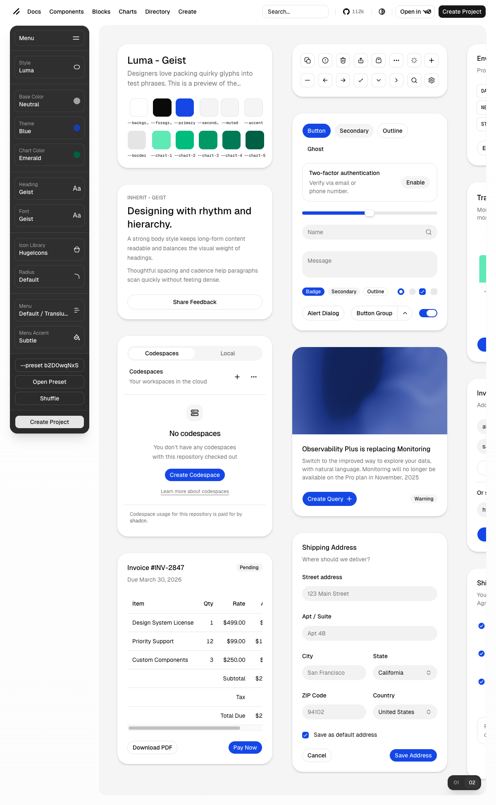
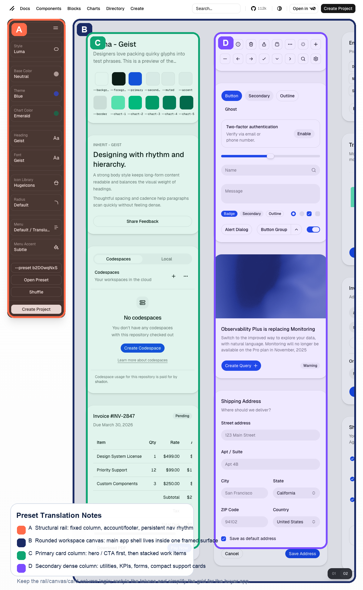
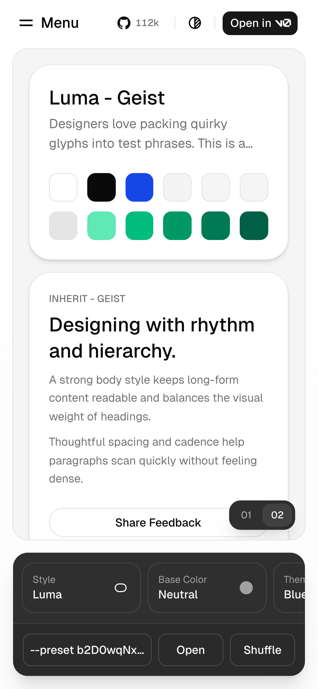
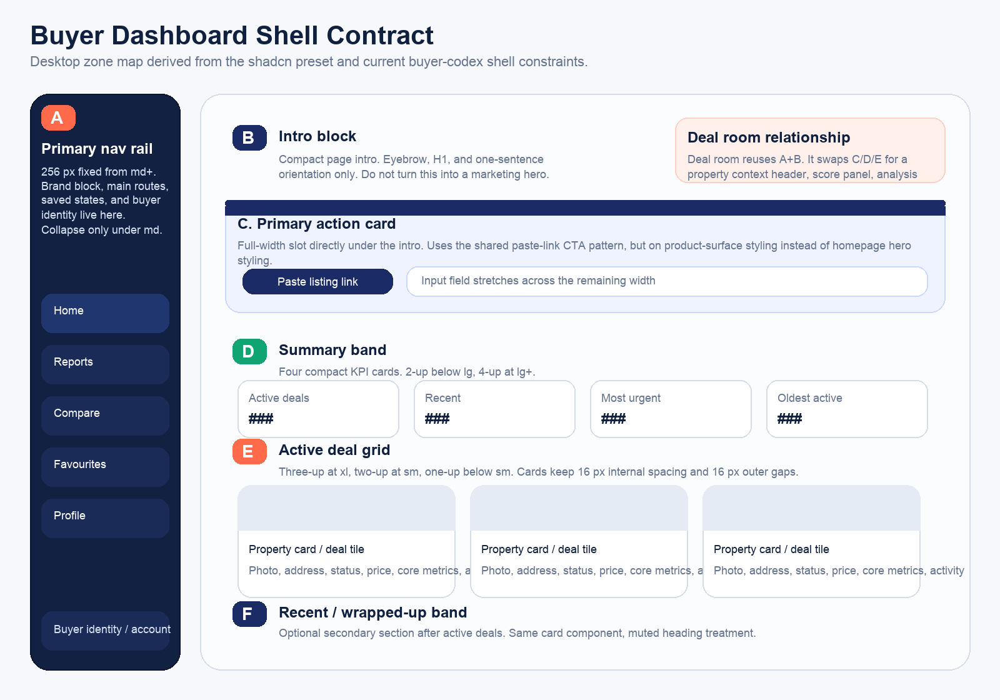
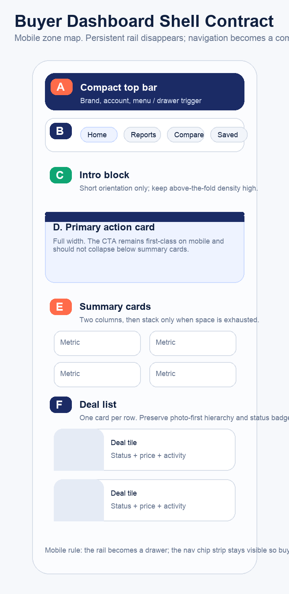

# Buyer Dashboard Shell Contract

Derived from `KIN-994`, the `KIN-980` epic hierarchy, and the existing `KIN-946` design-system outputs on `origin/main` as of `2026-04-13`.

## Why This Exists

`origin/main` already contained:

- the global visual hierarchy in `DESIGN.md`
- the current authenticated shell code in `src/app/(app)/layout.tsx`
- buyer dashboard card components in `src/components/dealroom/*`

It did **not** contain:

- preset-specific screenshot captures
- annotated shell zones
- explicit kept/restyled/rejected calls for `b2D0wqNxS`
- an exact dashboard shell order and density contract another agent could implement against directly

This file closes that gap.

## Reference Captures

### Desktop preset reference

### Desktop preset annotation

### Mobile preset reference

## Measured Reference Traits

Measured from the preset page at a `1200px` desktop viewport and the generated preview frame inside it.

| Reference trait | Observed value | buyer-codex translation |
|---|---:|---|
| Left structural rail | `192px` | Keep the fixed-rail idea, but use a `256px` buyer app rail because our nav labels and account block are more content-heavy than the preset controls |
| Gap between rail and canvas | `24px` | Keep a clear rail-to-canvas separation; do not let the content well touch the rail |
| Visible workspace canvas | `936px` wide inside the preset page | Preserve the idea of a framed working canvas, but map it to a `1152px` authenticated content well instead of a literal extra mega-card |
| Visible card column width | about `375px` | Use deal/search cards that land between `280px` and `360px`, capped at 3 columns on buyer-facing surfaces |
| Inter-column rhythm | about `44px` | Compress to `16px` standard gaps and `24px` only when the canvas has room; buyer workflow needs tighter density than a component showroom |
| Card radius | `26px` | Reject the exact radius; use buyer-codex product radii (`12px` to `16px`) from the PayFit-led token system |
| Rail styling | dark translucent / frosted | Treat as scaffold only; restyle with buyer-codex brand tokens and standard surfaces |

## buyer-codex Zone Maps

### Desktop contract

### Mobile contract

## Hard Shell Rules

### 1. Shared app-shell constants

- Desktop nav rail: `256px` fixed from `md` upward.
- Mobile nav behavior: no persistent rail below `md`; expose a compact top strip plus drawer/menu entry.
- Authenticated content well: `1152px` max width inside the buyer app shell.
- Page padding: `16px` mobile, `32px` from `md` upward.
- Vertical page rhythm: intro → CTA (`24px`), CTA → summary (`24px`), summary → active grid (`32px`), active grid → recent section (`32px`).

### 2. Section order is fixed

The buyer dashboard home must render in this order:

1. compact intro block
2. primary paste-link CTA card
3. summary metric band
4. active deals grid
5. optional recent/wrapped-up band

Do not move the CTA below the summary cards. The dashboard home is still an acquisition surface for the next property.

### 3. Intro block

- Eyebrow + H1 + one short support sentence only.
- No illustration, chart, or multi-line trust copy in this slot.
- Keep the intro visually calm so the CTA card owns the top action.

### 4. Primary action card

- Full width inside the content well.
- Must appear immediately below the intro.
- Uses the shared paste-link interaction pattern from marketing, but on product-surface styling.
- Minimum density target:
  - desktop: label + headline + one support sentence + input row
  - mobile: same content, still above summary cards

### 5. Summary metric band

- Maximum `4` KPI cards on dashboard home.
- Responsive rhythm:
  - under `640px`: `2 x 2`
  - `640px` to `1279px`: `2 x 2`
  - `1280px+`: `4 x 1`
- These cards are compact orientation aids, not mini dashboards. No charts, sparklines, or secondary paragraphs here.

### 6. Active deal grid

- Grid rhythm:
  - under `640px`: `1` column
  - `640px` to `1279px`: `2` columns
  - `1280px+`: `3` columns max
- Use `16px` gaps by default. Allow `24px` gaps only at the widest dashboard breakpoint.
- Never exceed `3` columns on buyer-facing dashboard/search/favourites surfaces. More columns lowers scan quality.

### 7. Deal / property card density

Every home-surface property card should keep this information above the fold:

- `16:9` media block
- address, clamped to `2` lines
- visible status pill in the top information cluster
- price as the first strong numeric emphasis
- one compact facts row (`beds · baths · sqft`)
- one lightweight activity row

Do not add secondary metrics, charts, or broker-only metadata to the home-card shell.

### 8. Recent / wrapped-up band

- Same card component as active deals.
- Muted section heading.
- Render only after active deals.
- If there are no recent deals, remove the section completely instead of showing a placeholder.

## Kept, Restyled, Rejected

### Keep

- Persistent left rail as the app's primary orientation anchor.
- Clear separation between navigation chrome and a framed working canvas.
- Large top-of-canvas primary action before denser operational content.
- Modular card system with consistent widths and reusable stacks.
- Mobile fallback that protects content space instead of forcing a narrow permanent sidebar.

### Restyle

- Replace the preset's dark frosted rail with buyer-codex brand/nav surfaces.
- Replace the preset's showroom card radii and shadows with PayFit-led product tokens.
- Replace generic preset widgets with buyer workflows: paste-link CTA, summary band, deal tiles.
- Translate the preset's column rhythm into buyer-safe density: tighter gaps, fewer columns, simpler scan paths.

### Reject

- The literal design-system control panel and preview-chrome copy.
- The preset's horizontally expansive seven-column showroom layout.
- Floating utility toolbars and experimentation controls unrelated to buyer work.
- The exact `26px` card radius on product cards.
- Any dashboard-home layout that buries the next-property CTA below analytics or recent history.

## Relationship To The Deal Room Shell

The buyer dashboard and the deal room must feel like one authenticated system.

- Reuse the same rail width, page padding, and content-well max width.
- Reuse the same card base, photo ratio, type hierarchy, and status-pill treatment.
- The deal room replaces the dashboard home stack with:
  - property context header
  - score / pricing summary band
  - analysis tabs or panels
  - denser secondary panels where appropriate
- The deal room is allowed to be one step denser than the dashboard home. The dashboard stays calmer because it is a routing surface, not a deep-work surface.

## Downstream Implementation Targets

If another agent implements this contract, the most likely touch points are:

- `src/app/(app)/layout.tsx`
- `src/components/dealroom/AppSidebar.tsx`
- `src/components/dealroom/BuyerDashboard.tsx`
- `src/components/dealroom/PasteLinkCTA.tsx`
- `src/components/dealroom/DealRoomGrid.tsx`
- `src/components/dealroom/DealRoomCard.tsx`
- `src/app/(dealroom)/layout.tsx` when the deal room shell is upgraded to match the buyer app shell family
